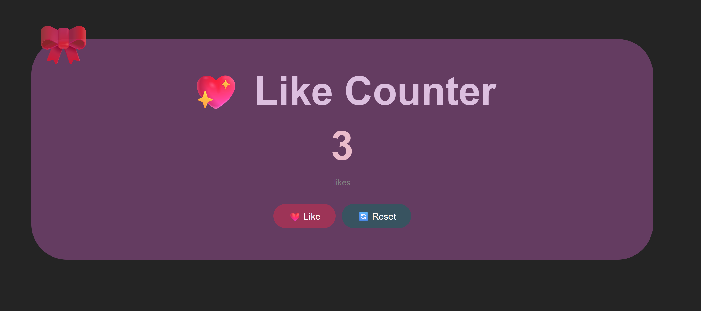

💖 LikeCounter

--> A simple and cute "Like Counter app" built with React + Vite. This was my first React.js project where I explored core concepts like components, JSX, props, and state management.

🚀 Features:

--> Click Like to increment the counter

--> Click Reset to reset back to 0

--> Reset button is disabled when count is 0

🎀 Cute ribbon decoration on the card

🛠️ Tech Stack:

--> React

--> Vite

--> JavaScript (JSX)

--> Inline CSS Styles

📦 Installation:

--> bashgit clone https://github.com/goatfdh/LikeCounter.git

--> cd LikeCounter/like-counter

--> npm install

--> npm run dev

📸 Preview:

🧠 Concepts Practiced:

--> useState hook

--> Event handling

--> Conditional styling

--> Component structure
